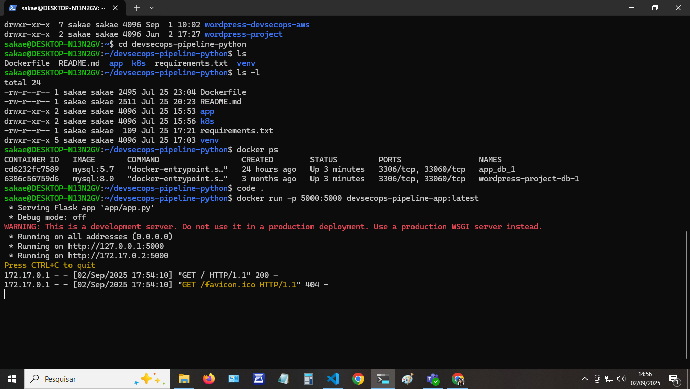
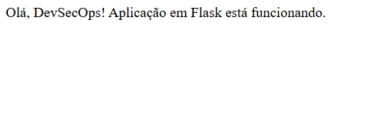
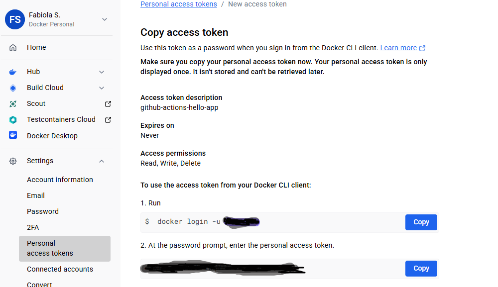
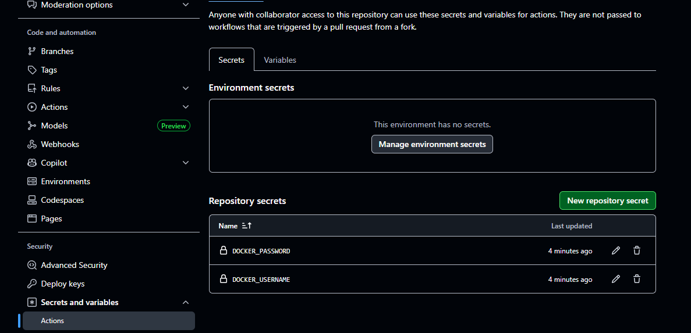

### DevSecOps Pipeline com Python 

Projetos para o meu Portfólio, demonstra uma pipeline CI/CD moderna com práticas de **versionamento**, **integração contínua**, **entrega contínua** e **segurança automatizada**, usando:

- WSL/Ubuntu
- Python (aplicação base)
- Docker
- GitHub Actions
- Kubernetes (Minikube)
- ArgoCD
- AWS (em breve)
- Ferramentas DevSecOps

## Estrutura

```bash
├── .github/workflows/   # Pipeline CI
├── app/                 # Aplicação em Python
├── k8s/                 # Manifests para Kubernetes
├── Dockerfile           # Imagem da aplicação
├── requirements.txt     # Dependências da aplicação
└── README.md            # Este arquivo
```
## Objetivos

* Automatizar build e deploy com GitHub Actions
* Usar ferramentas de análise de segurança (SAST/DAST)
* Empacotar a aplicação em container Docker
* Publicar em Kubernetes com ArgoCD
* Implantar boas práticas de DevSecOps

# Etapa 1 – Pipeline DevSecOps Completo
Objetivo: Demonstrar integração contínua, deploy contínuo e segurança em tempo de build/deploy. 

Parte 1: Criar estrutura do projeto no ambiente local

devsecops-pipeline-python/ 
├── app/ 
│   └── app.py 
├── Dockerfile 
├── requirements.txt 
├── .github/ 
│   └── workflows/ 
│       └── ci.yml 
├── k8s/ 
│   ├── deployment.yaml 
│   └── service.yaml 
└── README.md 

* Código fonte (app/app.py) 
* Arquivo Docker para containerização 
* Arquivo de dependências Python (requirements.txt) 
* Estrutura de CI/CD (.github/workflows/ci.yml) 
* Manifestos para deploy em Kubernetes (k8s/*.yaml) 
* Documentação (README.md) 

Parte 2: Criar o conteúdo do `app.py`
Aplicação feita com Flask + Python para testar a pipeline. Testar aplicação Flask localmente (no WSL).
1. Criar ambiente virtual isolado onde se pode instalar pacotes Python sem afetar o sistema inteiro	
```bash
python3 -m venv venv
```
2. Ativar ambiente	
```bash
source venv/bin/activate
```
3. Instalar as dependências do projeto
```bash
pip install -r requirements.txt
```
4. Instalar Flask.Dentro do venv o Flask será instalado apenas para esse projeto.
```bash
pip install flask
```
5. Registrar dependência para manter o projeto replicável por outras pessoas ou por pipelines automatizadas.	
```bash
pip freeze > requirements.txt
```
6. Rodar a aplicação
```bash
python3 app/app.py
```
---

# ETAPA 2 - Dockerização e Imagem Container

Objetivo desta Etapa:

Criar o Dockerfile para a sua aplicação Flask.

Construir a imagem Docker da sua aplicação localmente.

Testar se a aplicação roda corretamente dentro do contêiner Docker.

Passo 2.1 Dockerfile: Dentro da pasta raiz do seu projeto devsecops-pipeline-python/
```

FROM python:3.10-slim-buster

WORKDIR /app

COPY requirements.txt .

RUN pip install --no-cache-dir --upgrade pip && \
    pip install --no-cache-dir -r requirements.txt

COPY app/ app/

EXPOSE 5000

ENV FLASK_APP=app/app.py

CMD ["flask", "run", "--host=0.0.0.0", "--port=5000"]
```
Passo 2.2: Construir a Imagem Docker Localmente
Dentro do diretório raiz do seu projeto devsecops-pipeline-python/
```
cd ~/devsecops-pipeline-python
```
Execute o comando de build:
```
docker build -t devsecops-pipeline-app:latest 
```
Passo 2.3: Testar a Aplicação Rodando em Contêiner
```
docker run -p 5000:5000 devsecops-pipeline-app:latest
```


Teste no browser	Acessar http://localhost:5000



# Etapa 3 - Integração Contínua (CI) com GitHub Actions

Objetivo desta Etapa:

Automatizar o processo de construção da sua imagem Docker.

Adicionar um scan de segurança de imagem (com Trivy) na sua pipeline de CI.

Publicar a imagem construída e escaneada no Docker Hub de forma automática.

Tudo isso será acionado automaticamente a cada vez que você enviar código para o GitHub.
Passo 3.1: Configurar Segredos no GitHub (Para Acesso Seguro ao Docker Hub)

Gerar um Token de Acesso no Docker Hub


Adicionar os Segredos no seu Repositório GitHub: 


Passo 3.2: Criar o Arquivo de Workflow (ci.yml)
